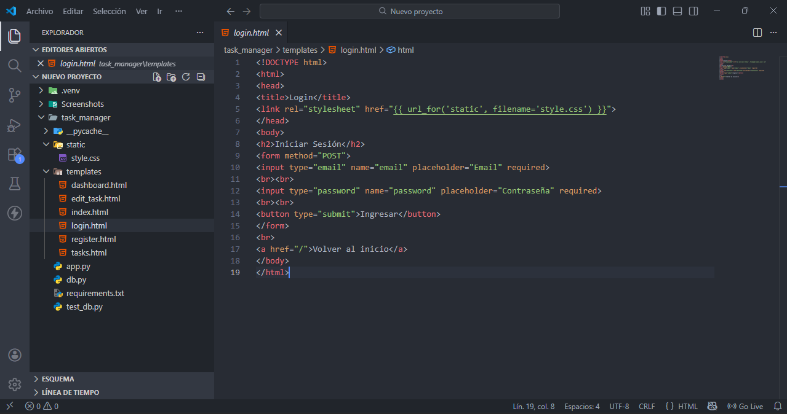
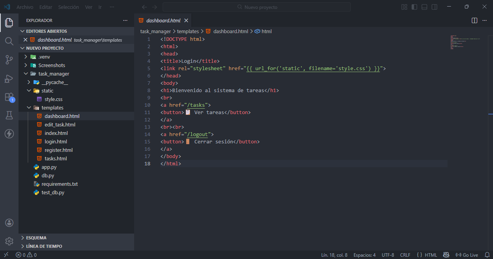
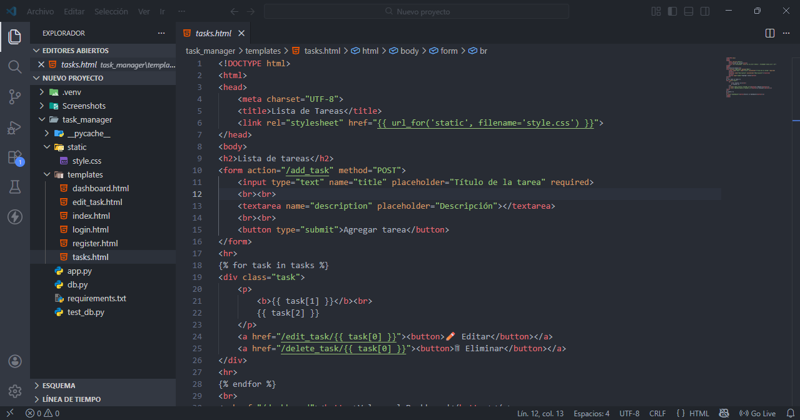
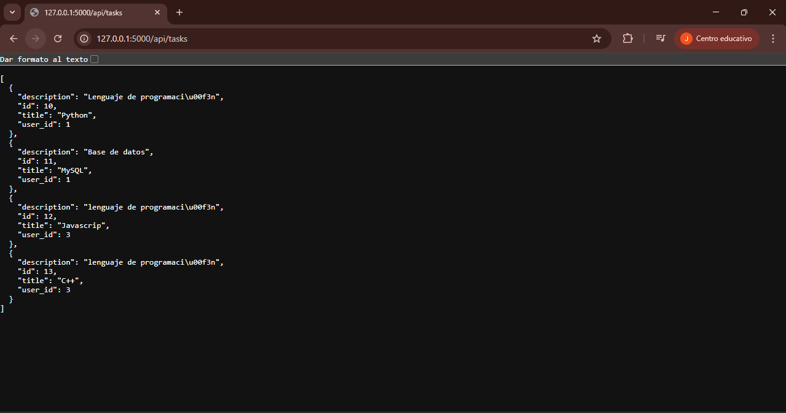

# Task Manager Web App

Aplicación web para gestionar tareas con autenticación de usuarios.

## Tecnologías usadas
- Python
- Flask
- MySQL
- HTML
- CSS
- REST API

## Funcionalidades
- Registro de usuarios
- Login con sesiones
- CRUD de tareas (crear, leer, actualizar, eliminar)
- API REST para consumir tareas desde aplicaciones externas

## Instalación y ejecución

1). Clonar el repositorio:

git clone https://github.com/tuusuario/task-manager.git

2). Instalar dependencias:

pip install -r requirements.txt

3). Configurar la base de datos MySQL:
   - Crear la base de datos task_manager
   - Crear las tablas users y `tasks` según tu script de creación  
   - Ajustar usuario y contraseña en db.py si es necesario

4). Ejecutar la app:

python app.py

5). Abrir en el navegador: `http://127.0.0.1:5000/`

---

## API Endpoints

| Método | Endpoint | Descripción |
|--------|---------|-------------|
| GET    | /api/tasks | Listar todas las tareas |
| POST   | /api/tasks | Crear nueva tarea |
| PUT    | /api/tasks/<id> | Actualizar tarea existente |
| DELETE | /api/tasks/<id> | Eliminar tarea existente |

---

## Screenshots

---

## Uso

1). Registrarse o iniciar sesión.  
2). Crear, editar o eliminar tareas desde la interfaz web.  
3). Consumir la API REST desde Postman o cualquier cliente HTTP.

---